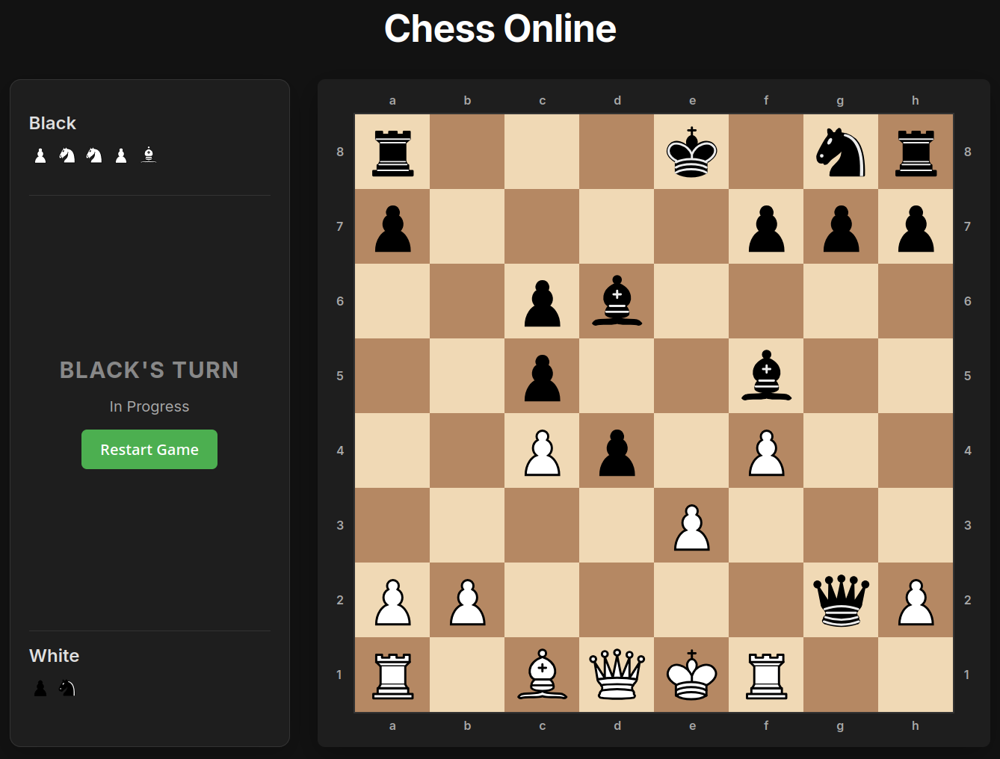
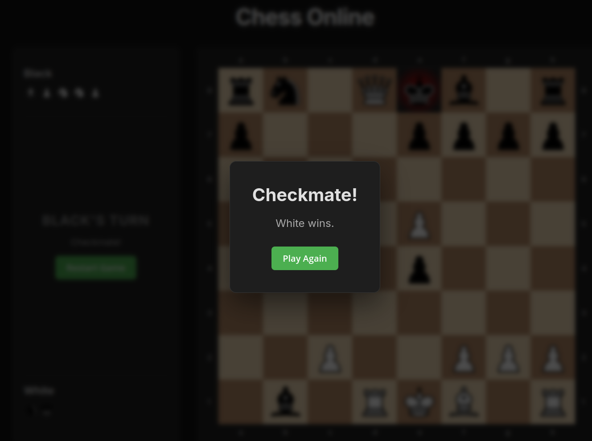
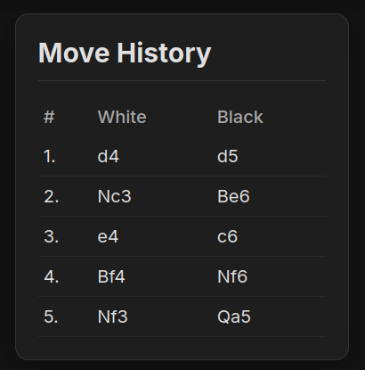

# Online Chess Game

A premium, interactive 2-player chess game built completely with vanilla HTML, CSS, and JavaScript. The game runs locally in your browser with no backend or server requirements.

## Features

- **Full Chess Logic**: Complete implementation of chess rules including valid moves, turn switching, and game state validation.
- **Special Moves**: Support for Castling (Kingside & Queenside), En Passant, and Pawn Promotion.
- **Check & Checkmate**: Automatic detection of Check, Checkmate, and Stalemate conditions.
- **Illegal Move Prevention**: Players cannot make moves that leave their King in check or move pieces out of turn.
- **Drag & Drop**: Intuitive drag-and-drop API integration for moving pieces, along with click-to-move support.
- **Move History**: A detailed move history panel showing algebraic notation for all moves played in the game.
- **Captured Pieces**: Visual tracking of pieces captured by each player.
- **Premium UI/UX**: Elegant, responsive dark-mode design with SVG piece assets and highlighted legal moves.

## How to Play

Since this game uses purely local web technologies and does not rely on any external server scripts or API calls, you can run it directly from your file system:

1. Clone or download this repository.
2. Open the `index.html` file in any modern web browser (e.g., Chrome, Firefox, Safari, Edge).
   - *Optionally, you can run a local development server (like VS Code Live Server or `npx serve`) and open the local URL.*
3. Play the game! White moves first.

## Project Structure

- `index.html`: The main entry point containing the UI structure and layout.
- `css/style.css`: Contains all styling for the board, panels, responsive layout, and animations.
- `js/main.js`: Bootstraps the application and links the logic to the UI.
- `js/chess.js`: The core chess engine containing all game rules, move generation, and state management.
- `js/ui.js`: Handles DOM manipulation, event listeners (click & drag), and visual updates based on game state.
- `js/assets.js`: Contains inline SVG code for all the high-quality chess piece graphics.

## Screenshots

## Author
Developed as part of the Lisbon Internship project. 2026
